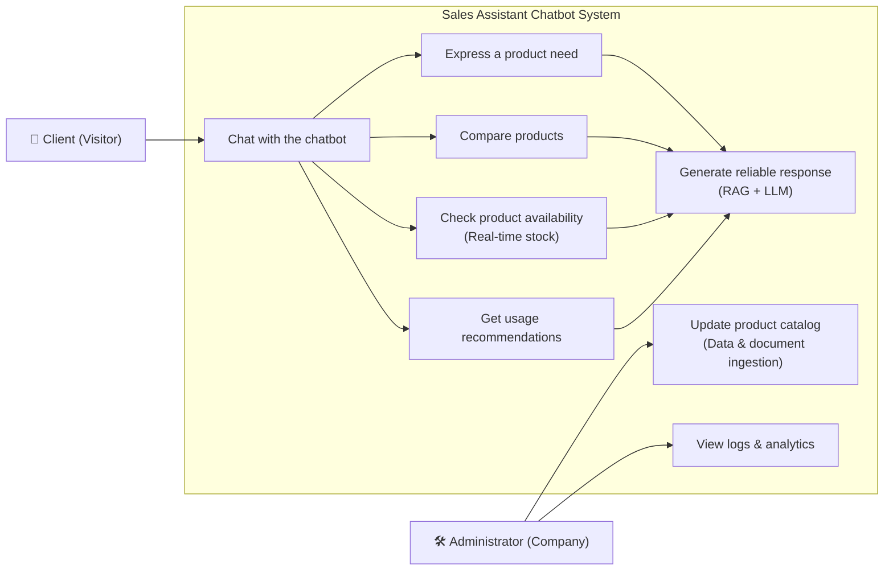

```mermaid


flowchart LR
    %% Acteurs
    User["👤 Client (Visitor)"]
    Admin["🛠️ Administrator (Company)"]

    %% Système
    subgraph Chatbot["Sales Assistant Chatbot System"]
        UC0["Chat with the chatbot"]
        UC1["Express a product need"]
        UC2["Compare products"]
        UC3["Check product availability\n(Real-time stock)"]
        UC4["Get usage recommendations"]
        UC7["Generate reliable response\n(RAG + LLM)"]

        UC5["Update product catalog\n(Data & document ingestion)"]
        UC6["View logs & analytics"]
    end

    %% Client interactions
    User --> UC0
    UC0 --> UC1
    UC0 --> UC2
    UC0 --> UC3
    UC0 --> UC4

    %% Admin interactions
    Admin --> UC5
    Admin --> UC6

    %% Internal logic (UML-like)
    UC1 --> UC7
    UC2 --> UC7
    UC3 --> UC7
    UC4 --> UC7

```
